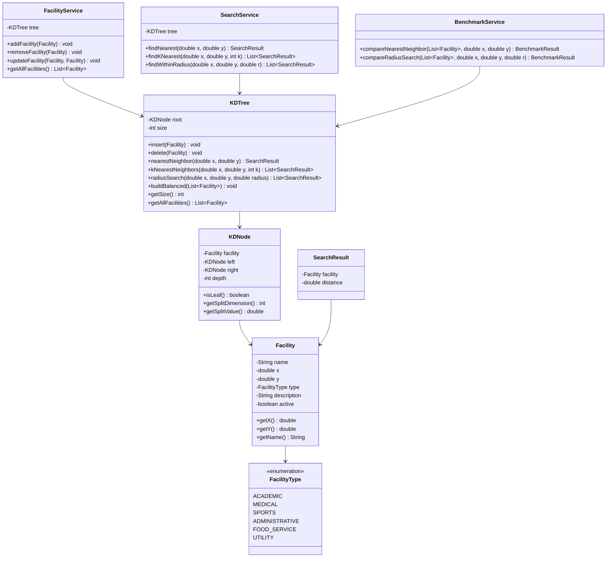
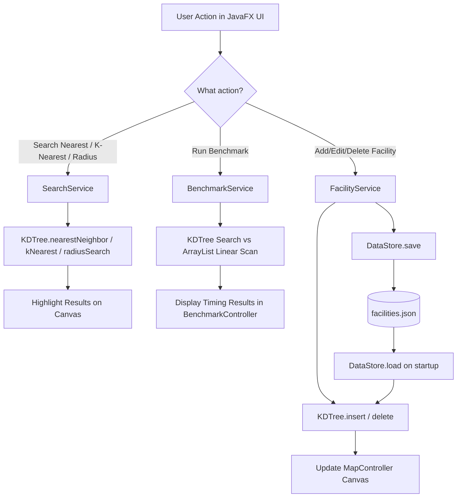

# DNSC Smart Campus Facility Finder — Project Blueprint

> **Project:** IT221 Data Structures Final Project
> **Data Structure:** KD-Tree (2-Dimensional)
> **Team Size:** 5 members
> **Stack:** Java 17 · JavaFX · Maven · GitHub

---

## Table of Contents

1. [System Validation](#1-system-validation)
2. [Software Architecture](#2-software-architecture)
3. [Project Roadmap (9 Phases)](#3-project-roadmap)
4. [Professor Defense Preparation](#4-professor-defense-preparation)
5. [Manuscript Outline](#5-manuscript-outline)
6. [Rubric Optimization Strategy](#6-rubric-optimization-strategy)
7. [Team Role Assignments](#7-team-role-assignments)
8. [Next Steps](#8-next-steps)

---

## 1. System Validation

### ✅ Strengths

| # | Strength | Why It Matters |
|---|----------|----------------|
| 1 | **KD-Tree is the natural fit** | Unlike projects that bolt a data structure onto a CRUD app, spatial search on a campus map *requires* a KD-Tree. The data structure is genuinely the engine, not a gimmick. |
| 2 | **Visual demonstrability** | You can literally draw the tree's partitions on screen. Professors see the algorithm working in real-time. |
| 3 | **Rich feature surface** | Insert, delete, nearest-neighbor, K-nearest, radius search — each exercises a different KD-Tree traversal. You won't struggle to show "variety of operations." |
| 4 | **Strong complexity story** | `O(log n)` average vs `O(n)` linear search gives you a clean comparative analysis for the manuscript. |
| 5 | **Reasonable implementation difficulty** | Harder than BST (impressive), but not as nightmarish as Suffix Trees or Treaps (achievable). |

### ⚠️ Weaknesses

| # | Weakness | Mitigation |
|---|----------|------------|
| 1 | **Deletion is notoriously hard** | Implement lazy deletion (mark as inactive, rebuild periodically). This is actually how many production KD-Trees work. You can defend this as a *design decision*, not a shortcut. |
| 2 | **Only 2D data** | This is fine for your project scope. A campus is a 2D plane. Don't try to generalize to K dimensions — it adds complexity without impressing anyone. |
| 3 | **Small dataset risk** | A tree with 5 nodes looks trivial. You need **50–100+ facilities** preloaded. We'll generate realistic DNSC campus data. |
| 4 | **Balancing** | KD-Trees can become degenerate if points are inserted in sorted order. We'll mitigate by using median-based bulk construction for the initial dataset. |

### 🔴 Risks

| # | Risk | Severity | Mitigation |
|---|------|----------|------------|
| 1 | **Team members can't explain KD-Tree during defense** | **CRITICAL** | Every member must understand: construction, dimension alternation, nearest-neighbor backtracking. Schedule internal "mock defense" sessions. |
| 2 | **JavaFX learning curve derails timeline** | Medium | Keep the UI simple. A Canvas for the map + a sidebar for controls. No fancy animations needed initially. |
| 3 | **Nearest-neighbor backtracking bug** | Medium | This is the #1 implementation bug. The algorithm must check the *other* subtree when the distance to the splitting plane is less than the current best. If you skip this, results will be wrong. We'll write targeted unit tests. |
| 4 | **Scope creep** | Medium | Do NOT add: user authentication, database persistence, REST APIs, pathfinding, or routing. These waste time and are outside the rubric. |

### 🟡 Missing Requirements to Address

| # | Requirement | Why |
|---|-------------|-----|
| 1 | **Facility categories** | Each facility should have a `type` (Academic, Medical, Sports, Admin, Food). This enables filtering and makes the system feel real. |
| 2 | **Preloaded dataset** | On first launch, the system should come with **50–100 DNSC campus facilities** already loaded. An empty app is not impressive. |
| 3 | **Performance benchmark panel** | A screen that runs the same query using both KD-Tree and ArrayList, showing execution time side-by-side. This is your "proof" for the manuscript and defense. |
| 4 | **Data persistence** | Save/load facilities to a JSON or CSV file so data survives between sessions. Simple file I/O — no database needed. |

### 🌟 Features That Will Impress Evaluators

| # | Feature | Impact |
|---|---------|--------|
| 1 | **Interactive map click** | User clicks on the canvas → system instantly highlights the nearest facility with a line drawn to it. Professor sees the algorithm live. **This is your killer feature.** |
| 2 | **KD-Tree partition visualization** | Draw the alternating X/Y split lines on the canvas. This shows the professor that the tree's internal structure is correct. |
| 3 | **Side-by-side complexity comparison** | Run nearest-neighbor on N=100, 500, 1000, 5000 points using both KD-Tree and linear scan. Display results in a table/chart. This directly supports your manuscript's complexity analysis. |
| 4 | **K-nearest visualization** | Highlight the K nearest facilities in a different color with distance labels. |
| 5 | **Radius search visualization** | Draw a circle of the specified radius around the query point. All facilities inside are highlighted. |

### 🚫 Features to AVOID

| # | Feature | Why Avoid |
|---|---------|-----------|
| 1 | User authentication / login | Not in rubric. Wastes 2–3 days minimum. |
| 2 | Database (MySQL, SQLite) | Overkill. Simple file I/O is sufficient and faster to implement. |
| 3 | REST API / Web backend | You're not graded on web development. |
| 4 | 3D / Octree extension | Sounds cool but doubles complexity. Stay 2D. |
| 5 | Pathfinding (A*, Dijkstra) | Different data structure entirely. Out of scope. |
| 6 | Real GPS coordinates | Use simple (x, y) pixel coordinates on your campus map image. Real GPS math is a rabbit hole. |

---

## 2. Software Architecture

### 2.1 Package Structure

```
src/main/java/com/mycompany/dsa_final_proj/
├── model/                    # Domain entities (data)
│   ├── Facility.java         # Name, coordinates, type, description
│   ├── FacilityType.java     # Enum: ACADEMIC, MEDICAL, SPORTS, ADMIN, FOOD
│   └── SearchResult.java     # Wraps facility + distance for search results
│
├── tree/                     # KD-Tree data structure (THE CORE)
│   ├── KDTree.java           # The KD-Tree implementation
│   ├── KDNode.java           # Internal tree node
│   └── KDTreeVisualData.java # Data object for visualization (split lines, visited nodes)
│
├── service/                  # Business logic layer
│   ├── FacilityService.java  # CRUD operations, delegates to KDTree
│   ├── SearchService.java    # Nearest, K-nearest, radius search logic
│   └── BenchmarkService.java # Performance comparison: KDTree vs ArrayList
│
├── persistence/              # Data persistence
│   └── DataStore.java        # Save/load facilities to/from JSON/CSV
│
├── ui/                       # JavaFX user interface
│   ├── MainApp.java          # JavaFX Application entry point
│   ├── controller/           # FXML controllers (or programmatic UI controllers)
│   │   ├── DashboardController.java
│   │   ├── FacilityFormController.java
│   │   ├── SearchController.java
│   │   ├── MapController.java        # Canvas/map visualization
│   │   └── BenchmarkController.java  # Performance comparison view
│   └── view/                 # FXML files or view builders
│       ├── dashboard.fxml
│       ├── facility_form.fxml
│       ├── search.fxml
│       ├── map.fxml
│       └── benchmark.fxml
│
├── util/                     # Utilities
│   ├── DistanceCalculator.java  # Euclidean distance math
│   └── SampleDataGenerator.java # Generates 50-100 sample facilities
│
└── Dsa_final_proj.java       # Main class (launches MainApp)

src/main/resources/
├── styles/
│   └── application.css       # JavaFX CSS styling
├── images/
│   └── campus_map.png        # DNSC campus map background image
└── data/
    └── facilities.json       # Preloaded facility data
```

### 2.2 Design Patterns Used

| Pattern | Where | Why |
|---------|-------|-----|
| **MVC (Model-View-Controller)** | Entire application | JavaFX naturally supports MVC. Models in `model/`, Views in `ui/view/`, Controllers in `ui/controller/`. Clean separation. |
| **Service Layer** | `service/` package | Business logic is separated from UI and data structure. The UI never touches `KDTree` directly — it goes through services. This is a SOLID principle (Dependency Inversion). |
| **Strategy Pattern** | `SearchService` | Different search strategies (nearest, K-nearest, radius) can be invoked through a common interface. Makes it easy to extend. |
| **Observer Pattern** | JavaFX Properties | JavaFX has built-in observable properties. When a facility is added/deleted, the map and list views update automatically. |

### 2.3 Class Relationships (Conceptual)



### 2.4 Data Flow



> [!IMPORTANT]
> **The UI layer NEVER directly accesses `KDTree`.** It always goes through `FacilityService` or `SearchService`. This separation is critical for clean architecture and testability. If the professor asks "Where is the KD-Tree used?", you point to the `tree/` package. If they ask "How does the UI interact with it?", you explain the service layer.

---

## 3. Project Roadmap

### Phase 1: Requirements Analysis *(Day 1–2)*

| Item | Detail |
|------|--------|
| **Objective** | Finalize exactly what the system will and will not do. Get all team members aligned. |
| **Deliverables** | Requirements document (can be a simple markdown file in the repo). |
| **Expected Output** | A checklist of features with clear YES/NO decisions. Every member signs off. |
| **Common Mistakes** | Vague requirements like "search facilities." You must specify: search by what? Return what? How many results? What if no results? |
| **Acceptance Criteria** | Every team member can verbally describe all features and the role of the KD-Tree without looking at notes. |

**Feature Checklist to Finalize:**

- [ ] Add facility (name, x, y, type, description)
- [ ] Edit facility
- [ ] Delete facility (lazy deletion)
- [ ] List all facilities
- [ ] Find nearest facility to a clicked point
- [ ] Find K nearest facilities
- [ ] Find all facilities within a radius
- [ ] Visualize facilities as dots on a 2D canvas
- [ ] Visualize KD-Tree partition lines
- [ ] Click-to-search on the map
- [ ] Performance benchmark: KD-Tree vs linear search
- [ ] Preloaded dataset (50–100 facilities)
- [ ] Data persistence (JSON file)
- [ ] Filter by facility type

---

### Phase 2: System Design *(Day 2–3)*

| Item | Detail |
|------|--------|
| **Objective** | Finalize the architecture described in Section 2 above. Set up the Maven project with JavaFX dependencies. Create the package structure. |
| **Deliverables** | Updated `pom.xml` with JavaFX deps. Empty package directories created. `README.md` with architecture overview. |
| **Expected Output** | The project compiles and opens a blank JavaFX window. |
| **Common Mistakes** | Spending too long on design. You need a *good enough* design, not a perfect one. The architecture above is your design — implement it. Also: fighting with JavaFX module system. We'll handle that. |
| **Acceptance Criteria** | `mvn javafx:run` opens a blank JavaFX window with the title "DNSC Smart Campus Facility Finder". All packages exist. |

---

### Phase 3: KD-Tree Implementation *(Day 3–6)* ⭐ CRITICAL PATH

> [!CAUTION]
> This is the single most important phase. If the KD-Tree is wrong, the entire project collapses. Budget extra time here. Write this in isolation with no UI dependencies.

| Item | Detail |
|------|--------|
| **Objective** | Implement `KDNode` and `KDTree` with: `insert`, `buildBalanced`, `nearestNeighbor`, `getAllFacilities`. No GUI yet — test via console/main method. |
| **Deliverables** | `KDNode.java`, `KDTree.java` in the `tree/` package. Console test output proving correctness. |
| **Expected Output** | Given a set of test points, the tree correctly identifies the nearest neighbor (verified manually). |
| **Common Mistakes** | |

**Top 3 bugs that kill KD-Tree projects:**

| # | Bug | Explanation |
|---|-----|-------------|
| 1 | **Forgetting to check the other subtree** | During nearest-neighbor search, after exploring the "closer" child, you MUST check if the distance to the splitting hyperplane is less than the current best distance. If yes, you MUST explore the "farther" child too. Skipping this produces *wrong results* that look correct on small datasets but fail on larger ones. |
| 2 | **Wrong dimension alternation** | Depth 0 splits on X, depth 1 splits on Y, depth 2 splits on X again. Use `depth % 2`. If you hardcode or get this wrong, the tree structure is invalid. |
| 3 | **Comparing distance² vs distance** | For efficiency, compare squared distances (avoids `Math.sqrt`). But be consistent — if you mix squared and non-squared, comparisons break silently. |

| Item | Detail |
|------|--------|
| **Acceptance Criteria** | Insert 10 manually chosen points. For 5 different query points, verify nearest-neighbor results by hand calculation (Euclidean distance). All 5 must be correct. |

---

### Phase 4: CRUD Operations *(Day 5–7)*

| Item | Detail |
|------|--------|
| **Objective** | Implement `FacilityService` for add, edit, delete, list. Implement `DataStore` for JSON persistence. Implement `Facility` model and `FacilityType` enum. |
| **Deliverables** | `Facility.java`, `FacilityType.java`, `FacilityService.java`, `DataStore.java`. Preloaded `facilities.json` with 50+ entries. |
| **Expected Output** | Add a facility → it appears in the tree. Delete a facility → it's marked inactive. Save → close app → reopen → data is still there. |
| **Common Mistakes** | Trying to implement true KD-Tree deletion (finding in-order successor in alternating dimensions). Use **lazy deletion** instead: mark the node's `active` field as `false`. When the tree gets too many inactive nodes (e.g., > 30%), rebuild the tree from the active nodes. This is legitimate and used in practice. |
| **Acceptance Criteria** | CRUD cycle works: Add → verify in list → Edit → verify changes → Delete → verify removed from list → Save → Restart → Data persists. |

---

### Phase 5: Nearest Neighbor Search *(Day 6–8)*

| Item | Detail |
|------|--------|
| **Objective** | Implement proper nearest-neighbor with backtracking. Extend to K-nearest-neighbors using a max-heap (PriorityQueue). |
| **Deliverables** | `SearchService.java` with `findNearest()` and `findKNearest()`. `SearchResult.java` model. |
| **Expected Output** | Given query point (150, 75), returns the single nearest facility. Given K=3, returns the 3 nearest sorted by distance. |
| **Common Mistakes** | For K-nearest, students often do K separate nearest-neighbor queries excluding previous results. This is `O(k·n)` worst case. Instead, use a single traversal with a max-heap of size K. When a closer point is found and the heap is full, remove the farthest point from the heap. This is the correct `O(n log k)` approach — and you can explain this during defense. |
| **Acceptance Criteria** | Test with 50+ facilities. Verify K-nearest results match brute-force ArrayList results for 10 different query points. 100% match required. |

---

### Phase 6: Radius Search *(Day 7–9)*

| Item | Detail |
|------|--------|
| **Objective** | Implement range/radius search: find all facilities within distance R of a query point. |
| **Deliverables** | `findWithinRadius()` method in `SearchService`. |
| **Expected Output** | Given query (200, 150) and radius 50, returns all facilities within that circle. |
| **Common Mistakes** | Not pruning branches. The power of KD-Tree radius search is that you skip entire subtrees when the splitting plane is farther than R from the query point. If you visit every node, you've just written a linear scan with extra steps. |
| **Acceptance Criteria** | Verify results match brute-force for 10 queries. Verify that the number of nodes visited is significantly less than the total number of nodes (log this count). |

---

### Phase 7: Visualization Module *(Day 8–12)* ⭐ HIGH IMPACT

> [!TIP]
> This is where your project transforms from "we implemented a KD-Tree" to "we built an interactive spatial search system." This phase has the highest impact on your System Functionality and Video Presentation scores.

| Item | Detail |
|------|--------|
| **Objective** | Build the JavaFX UI with: interactive 2D map canvas, facility list panel, search controls, and result highlighting. |
| **Deliverables** | All FXML/controller files. Working interactive application. |
| **Expected Output** | A polished application where users can click on the map, see the nearest facility highlighted, draw radius circles, and view partition lines. |
| **Common Mistakes** | Building the UI first and trying to plug the KD-Tree in later. The tree should already be fully working (Phases 3-6) before this phase begins. Another mistake: making the UI too complex. You need exactly 4-5 screens, not 15. |
| **Acceptance Criteria** | |

**UI Screens Required:**

| Screen | Purpose |
|--------|---------|
| **Dashboard** | Overview: total facilities, quick stats, navigation to other screens |
| **Map View** | Canvas with facilities as colored dots. Click to search. Toggle partition lines. Toggle radius circle. |
| **Facility Manager** | Table of all facilities. Add/Edit/Delete buttons. Filter by type. |
| **Search Panel** | Input coordinates + search type (nearest / K-nearest / radius). Display results with distances. |
| **Benchmark** | Run comparison, display timing table, maybe a simple bar chart. |

**Acceptance Criteria:** A non-technical person can open the app, click on the map, and immediately understand what it does.

---

### Phase 8: Testing and Validation *(Day 11–13)*

| Item | Detail |
|------|--------|
| **Objective** | Validate correctness of the KD-Tree against brute-force. Run performance benchmarks. |
| **Deliverables** | Test results document. Benchmark data table. Bug fixes. |
| **Expected Output** | A table showing KD-Tree vs ArrayList timing for N = 100, 500, 1000, 5000, 10000 points. |
| **Common Mistakes** | Only testing with the preloaded dataset. You need to test with randomly generated large datasets to prove scalability. Also: not warming up the JVM before benchmarking (first few runs are always slower due to JIT compilation). |
| **Acceptance Criteria** | 100% correctness match against brute-force. KD-Tree is measurably faster than ArrayList for N > 500. Results documented. |

**Benchmark Table Template:**

| Dataset Size | KD-Tree Nearest (ms) | ArrayList Nearest (ms) | Speedup |
|-------------|----------------------|------------------------|---------|
| 100         | ?                    | ?                      | ?x      |
| 500         | ?                    | ?                      | ?x      |
| 1,000       | ?                    | ?                      | ?x      |
| 5,000       | ?                    | ?                      | ?x      |
| 10,000      | ?                    | ?                      | ?x      |

---

### Phase 9: Documentation and Manuscript *(Day 12–15)*

| Item | Detail |
|------|--------|
| **Objective** | Write the technical manuscript. Record the video presentation. Final polish. |
| **Deliverables** | Technical manuscript (PDF). Video presentation. Clean GitHub repository with README. |
| **Expected Output** | A manuscript that reads like a research paper, not a homework report. |
| **Common Mistakes** | Writing the manuscript the night before. Starting the manuscript *during* Phase 8 is ideal, since benchmark data feeds directly into it. Also: recording the video with no script. Write a script. Practice once. Then record. |
| **Acceptance Criteria** | Manuscript covers all sections in the outline (Section 5 below). Video is under the time limit, demonstrates all features, and every member speaks. |

---

## 4. Professor Defense Preparation

> [!WARNING]
> This section is non-negotiable. Every single team member must be able to answer ALL of these questions. If one member stumbles during defense, it can drag the entire team's score down.

### Core Questions & Answers

**Q: Why did you choose KD-Tree?**

> Our system is fundamentally a spatial search problem. We need to find the closest campus facility to any given point on a 2D map. A KD-Tree is a space-partitioning data structure specifically designed for efficient multidimensional search. It divides the 2D space by alternating between X and Y coordinates at each level, allowing us to eliminate large portions of the search space during queries.

**Q: Why not just use an ArrayList?**

> An ArrayList requires checking every single facility for every search query. That's O(n) time complexity. If we have 1,000 facilities, we make 1,000 distance calculations every time someone clicks on the map. A KD-Tree achieves O(log n) on average by pruning entire subtrees that cannot contain the nearest point. For 1,000 facilities, that's roughly 10 comparisons instead of 1,000. We have benchmark data that confirms this [point to benchmark screen].

**Q: What is the time complexity of your operations?**

| Operation | KD-Tree (Average) | KD-Tree (Worst) | ArrayList |
|-----------|--------------------|------------------|-----------|
| Insert | O(log n) | O(n) | O(1) |
| Nearest Neighbor | O(log n) | O(n) | O(n) |
| K-Nearest Neighbor | O(k log n) | O(kn) | O(n log n)* |
| Radius Search | O(√n + m) | O(n) | O(n) |
| Build (balanced) | O(n log n) | O(n log n) | N/A |
| Delete (lazy) | O(log n) | O(n) | O(n) |

*ArrayList K-nearest requires sorting all distances: O(n log n), or using a partial sort: O(n log k).*

**Q: What are the limitations of KD-Tree?**

> 1. **Worst-case degradation:** If points are inserted in sorted order, the tree becomes essentially a linked list, degrading to O(n). We mitigate this by building the tree using median-based balanced construction.
> 2. **Not ideal for very high dimensions:** KD-Trees lose their advantage as dimensions increase (curse of dimensionality). However, we're in 2D, which is the sweet spot.
> 3. **Deletion is complex:** True deletion requires finding replacement nodes while maintaining the dimensional splitting invariant. We use lazy deletion as a pragmatic solution.
> 4. **Static vs. dynamic:** KD-Trees work best when the dataset doesn't change frequently. For our use case (campus facilities change rarely), this is not an issue.

**Q: How does the nearest-neighbor search actually work?**

> The algorithm works in three steps:
> 1. **Descend:** Starting at the root, go left or right based on the current splitting dimension until you reach a leaf. That leaf is your initial "best guess."
> 2. **Backtrack:** As you unwind the recursion, check if the current node is closer than your best guess. Update if so.
> 3. **Check the other side:** At each level, compute the distance from the query point to the splitting plane. If this distance is less than your current best distance, the other subtree *might* contain a closer point, so you must explore it. This is the key insight that makes KD-Tree correct.
>
> Without step 3, the algorithm can miss the actual nearest neighbor. We can demonstrate this with a specific example on our visualization.

**Q: Why is the data structure central to your system?**

> Remove the KD-Tree from our system and you have a basic CRUD app with a list of facilities. The KD-Tree is what enables:
> - O(log n) nearest-neighbor search instead of O(n)
> - Efficient radius queries that skip irrelevant regions of space
> - The visual partition of the campus map into search regions
> - The entire "Smart" in "Smart Campus Facility Finder"
>
> The KD-Tree doesn't support the system; it IS the system.

### Tricky Follow-Up Questions

**Q: When would KD-Tree be a BAD choice?**

> When the data is very high-dimensional (e.g., 20+ dimensions), when the dataset is tiny (under ~20 points, where linear scan is faster due to lower overhead), or when data changes extremely frequently (heavy insert/delete workloads can unbalance the tree).

**Q: What happens if two facilities have the same coordinates?**

> We handle duplicates by allowing them in the tree but ensuring they are treated as distinct nodes. In practice, two facilities at the exact same coordinates is rare on a campus, but our implementation handles it correctly.

**Q: How do you ensure the tree stays balanced?**

> During initial construction, we use the median point as the root of each subtree, which guarantees a balanced tree. For subsequent individual insertions, the tree may become slightly unbalanced, but with lazy deletion and periodic rebuilds, the tree stays near-optimal.

---

## 5. Manuscript Outline

```
1. INTRODUCTION
   1.1 Background of the Study
   1.2 Problem Statement
   1.3 Objectives
   1.4 Scope and Limitations
   1.5 Significance of the Study

2. REVIEW OF RELATED LITERATURE
   2.1 Spatial Data Structures
   2.2 KD-Tree: History and Theory
   2.3 Nearest Neighbor Search Algorithms
   2.4 Related Systems and Applications

3. METHODOLOGY
   3.1 System Architecture
   3.2 KD-Tree Construction Algorithm
   3.3 Nearest Neighbor Search Algorithm
   3.4 K-Nearest Neighbor Algorithm
   3.5 Radius Search Algorithm
   3.6 Technology Stack
   3.7 Development Process

4. RESULTS AND DISCUSSION
   4.1 System Features and Screenshots
   4.2 Complexity Analysis
       4.2.1 Time Complexity
       4.2.2 Space Complexity
   4.3 Performance Benchmarks
       4.3.1 KD-Tree vs Linear Search Comparison
       4.3.2 Scalability Analysis
   4.4 Visualization Effectiveness

5. CONCLUSIONS AND RECOMMENDATIONS
   5.1 Summary of Findings
   5.2 Conclusions
   5.3 Recommendations for Future Work
```

> [!TIP]
> **Key Manuscript Strategy:** Section 4.3 is where you win the manuscript score. Real benchmark data with actual timing numbers, presented in tables and charts, elevates your manuscript from "student report" to "technical analysis." Do not skip this.

---

## 6. Rubric Optimization Strategy

### Algorithm Implementation (20/20)

| Requirement | How We Satisfy It |
|-------------|-------------------|
| Core data structure implemented from scratch | KD-Tree coded manually — no libraries |
| Multiple operations demonstrated | Insert, delete, nearest, K-nearest, radius, balanced build |
| Correct implementation | Validated against brute-force for 10+ test cases |
| Complexity understood | Every member can state and explain Big-O for each operation |

**Risk to 20/20:** The nearest-neighbor backtracking bug. If your search returns wrong results, this score collapses. Test obsessively.

### Technical Manuscript (20/20)

| Requirement | How We Satisfy It |
|-------------|-------------------|
| Problem clearly stated | "Linear search over campus facilities does not scale" |
| Data structure theory explained | Full explanation with diagrams of KD-Tree construction and search |
| Complexity analysis present | Table of Big-O for all operations + comparison with ArrayList |
| Empirical results | Benchmark table with real timing data for N = 100 to 10,000 |
| Professional formatting | Follows the outline in Section 5 above |

**Risk to 20/20:** Weak empirical data. If you only test with N=50, the manuscript lacks substance. Test up to N=10,000.

### System Functionality (20/20)

| Requirement | How We Satisfy It |
|-------------|-------------------|
| System works end-to-end | CRUD + Search + Visualization all functional |
| Data structure is central | KDTree powers all search operations |
| Features are useful | Interactive map click, radius search, K-nearest |
| Robust (no crashes) | Input validation, error handling, edge cases covered |

**Risk to 20/20:** A crash during the demo. Test every edge case: empty tree search, zero radius, negative coordinates, duplicate names, maximum K value.

### Code Quality (20/20)

| Requirement | How We Satisfy It |
|-------------|-------------------|
| Clean OOP | Proper encapsulation, meaningful classes, no God classes |
| SOLID principles | Single Responsibility (Service layer vs Tree vs UI). Open/Closed (FacilityType enum is extensible). Dependency Inversion (UI depends on services, not on KDTree directly). |
| Readable code | Meaningful names, consistent formatting, Javadoc on public methods |
| Version control | Git history showing incremental commits, not one giant commit |

**Risk to 20/20:** "Spaghetti code" where the UI directly manipulates the KDTree. Enforce the service layer strictly.

### Video Presentation (20/20)

| Requirement | How We Satisfy It |
|-------------|-------------------|
| All features demonstrated | Scripted walkthrough covering every feature |
| Data structure explained | Visual explanation of KD-Tree with the partition visualization |
| All members participate | Each member presents their area of responsibility |
| Professional quality | Clear audio, no dead air, rehearsed flow |

**Risk to 20/20:** Unscripted presentation. Write a script. Assign sections. Practice once. Record.

---

## 7. Team Role Assignments

| Role | Responsibilities | Phases Owned |
|------|-----------------|--------------|
| **Member 1: KD-Tree Engineer** | Implements `KDTree.java`, `KDNode.java`. Owns all tree algorithms. Must be able to explain every line during defense. | Phase 3, 5, 6 |
| **Member 2: Application Architect** | Implements `FacilityService`, `SearchService`, `BenchmarkService`, `DataStore`. Owns the service layer and data models. | Phase 2, 4 |
| **Member 3: UI/UX Developer** | Implements all JavaFX screens, FXML files, controllers, CSS styling. Owns the visual experience. | Phase 7 |
| **Member 4: QA & Benchmark Lead** | Writes test cases, runs benchmarks, validates KD-Tree correctness against brute-force, documents results. Owns data integrity. | Phase 8 |
| **Member 5: Documentation & Presentation Lead** | Writes the manuscript, creates the video script, manages the GitHub README, coordinates the final presentation. | Phase 1, 9 |

> [!IMPORTANT]
> **Cross-training is mandatory.** Every member must understand the KD-Tree at a conceptual level. Schedule at least 2 internal "teach-back" sessions where Member 1 explains the algorithm to the team, and any member can be randomly asked to explain it during defense.

---

## 8. Next Steps

We are currently at the **very beginning of Phase 1**. Here is exactly what we do next:

### Immediate Actions (Today)

1. **Team Alignment:** Share this blueprint with all 5 members. Everyone reads it fully.
2. **Feature Checklist Sign-Off:** Finalize the feature checklist in Phase 1. Decide YES/NO on each feature.
3. **Confirm: Do you want to proceed with this architecture?** If yes, I will guide you through Phase 2: setting up the `pom.xml` with JavaFX dependencies, creating the package structure, and getting a blank JavaFX window running.

### Do NOT Do Yet

- ❌ Do not start coding the KD-Tree yet (Phase 3)
- ❌ Do not start designing the UI yet (Phase 7)
- ❌ Do not start writing the manuscript yet (Phase 9)

We proceed phase by phase, in order.

---

> **Your move:** Review this blueprint with your team. When you're ready, tell me:
> 1. Do you approve this architecture and feature set?
> 2. Any features to add or remove?
> 3. Are you ready to begin Phase 2 (project setup)?
